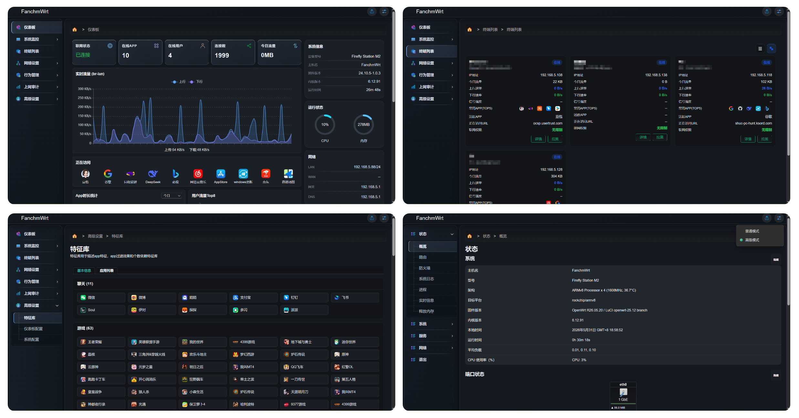

  <h1>✨ 基于项目源码编译的FanchmWrt固件 ✨</h1>

  
  
  
  

  
  
  
  
  
  
  

---

## 🤔 项目介绍 
**FanchmWrt** 是基于 OpenWrt 深度开发的 **家用防火墙系统** ，集成 **应用过滤功能** ，性能更强大

> [!TIP]
> 📢本项目提供了一个 **将 rockchip 设备适配至 FanchmWrt 项目源码** 的参考实现，支持通过源码编译生成 **`sysupgrade`** 格式固件。该格式可手动在线刷写升级， **一次适配，持续更新** ，告别重复刷机

---

## 😅 第三方插件 
| 插件                     |  状态   | 源码地址                                                                    | 备注         |
|:------------------------:|:------:| ---------------------------------------------------------------------------- | ------------ |
| luci-app-ramfree         |  ✅   | [Kwonelee/openwrt-packages](https://github.com/Kwonelee/openwrt-packages)    | 🟢 已测试    |
| luci-app-filebrowser-go  |  ✅   | [Kwonelee/openwrt-packages](https://github.com/Kwonelee/openwrt-packages)    | 🟢 已测试    |
| luci-app-openlist2       |  ✅   | [sbwml/luci-app-openlist2](https://github.com/sbwml/luci-app-openlist2)      | 🟢 已测试     |
| luci-app-lucky           |  ✅   | [gdy666/luci-app-lucky](https://github.com/gdy666/luci-app-lucky)            | 🟢 已测试     |
| luci-app-zerotier        |  ✅   | [sbwml/openwrt_pkgs](https://github.com/sbwml/openwrt_pkgs)                  | 🟢 已测试     |
| 其他                     |  ⏳   |                                                                               |               |

✅ 支持 - ⏳ 计划中 - ⭕ 不支持

## 😊 支持设备 
| 设备         |  状态     |  包名                                                                  | 备注                        |
|-------------|:---------:| ----------------------------------------------------------------------- | ---------------------------- |
| station-m2  |    ✅    | openwrt-rockchip-armv8-firefly_station-m2-squashfs-sysupgrade.img.gz    | 🟢 已测试                    |
| 其他        |    ⏳    |                                                                          |                              |

✅ 支持 - ⏳ 计划中 - ⭕ 不支持

---

## 🤗 项目截图 

---

# 🌟 Star戳一戳，好运加满！😆
> **"点过 `Star` 的朋友，颜值与智慧双双在线！✨"**
> 
> **"您的每一个⭐️，都是开源土壤里的一缕阳光，让灵感发芽，让创造生长~"**

## 🎉 Thanks 
- [fanchmwrt](https://github.com/fanchmwrt) ； [QiuSimons](https://github.com/QiuSimons/YAOF)
- [fanchmwrt-packages](https://github.com/Kwonelee/fanchmwrt-packages) ； [openwrt-packages](https://github.com/Kwonelee/openwrt-packages)
- [openwrt](https://github.com/openwrt/openwrt) ； [immortalwrt](https://github.com/immortalwrt/immortalwrt) ； [lede](https://github.com/coolsnowwolf/lede) ； [istoreos](https://github.com/istoreos/istoreos)

## 🙏 免责声明 
- 📚 本固件仅供学习研究，严禁用于任何商业用途
- 🤝 使用本固件产生的所有后果均由使用者自行承担
- ⚠️ 固件仍可能存在缺陷，开发者不提供任何形式的技术支持
- 📜 请严格遵守国家网络安全法律法规，合法使用

